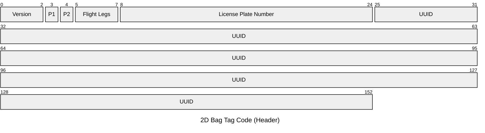
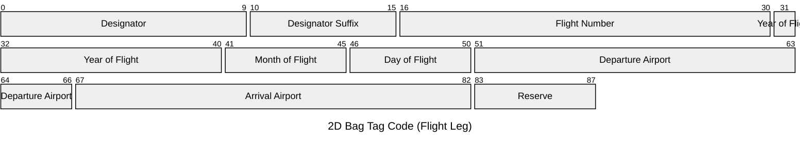

# IATA Draft for 2D Barcoded Bag Tag

## Short Description

To this day, the Interleaved 2 of 5 barcode, which encodes the License Plate Number, is the standard for baggage identification in the airline transportation industry. This tried and tested technology has various disadvantages, which are to be eliminated by the introduction of a new barcode. This is described in this draft, which could be introduced in future as an IATA Recommended Practice.

## Considerations

Baggage is currently identified using a 10-digit License Plate Number. This number is printed on the baggage tag in the form of an Interleaved 2 of 5 barcode. All subsequent baggage handling systems read and process this in order to bring the baggage to the desired destination.

### Disadvantages of current solution

* The current standard uses Interleaved 2 of 5 barcodes without a check digit, which leads to misreadings in baggage sorting systems.
* The License Plate Number contains an identification for the airline with 3 characters, therefore a maximum of 10,000,000, in practice only 1,000,000 IDs are available per airline. This leads to frequent overflow.
* In order to obtain information on the routing of the baggage, the parallel transmission of baggage information is always necessary. In the event of a system failure, correct baggage transportation is generally no longer possible.

### Requirements for a new code

* Broad reading support from the readers available on the market
* Broad printing support from the bag tag printers available on the market
* Use of an open standard, also to avoid license costs
* The ability to read even partially damaged barcodes
* The ability to use a unique identifier without the risk of number overflow
* Backwards compatibility with the current standard to ensure parallel use during the transition period
* The new code must be supplemented with additional data in order to be able to implement a fallback level in the event of a system failure
* The passenger name should not be part of the code to avoid problems with data protection laws

### Dependencies during the introduction of the new code

* Existing label printers and self-service kiosks must be equipped to print the new 2D code on the bag tags
* In Parallel: Baggage systems such as DCS, BHS, BRS, etc. must be upgraded to be able to handle the new globally unique identifier instead of a 10-digit baggage ID and the additional data to benefit from the new features
* Scanner gates, hand scanners, readers and cameras must be equipped to read 2D barcodes

# Specifications

## General specifications

* The used 2D Barcode is the widely known and used "quick-response code" (QR Code) as defined in [ISO/IEC 18004 in the latest version of 2024](https://www.iso.org/standard/83389.html) This code is free to use without any license issues.
* A new global unique identifier is introduced to replace the license plate number in future. A UUID as defined in [RFC 4122](https://datatracker.ietf.org/doc/html/rfc4122) is used. ([See discussion](#discussions))
* The QR code is printed on both "sides" of a bag tag. It should be placed on the bag tag in combination with the previous IL2of5 barcode to maintain downward compatibility

### Transition time

There will be a longer transition time while the old and the new code is still required. This is taken into account by the specifications in this standard.

## Data definition

### Packetview

#### Header


#### Flight Leg



### Description Table

#### Overall

| Fieldname | M/C/O | Bit length | Codeset | (Example) Value | Description |
| --------- | ----- | ---------- | ----- | -- | ----------- |
| Version   | M     | 3    | Numeric (0-7)      | 0x1  | The Version of the Code-Specification which is currently 1 |
| UUID presence | M | 1 | Boolean | 0x1 | Set to 1 if UUID is present, otherwise 0 |
| LPN Number presence | M | 1 | Boolean | 0x1 | Set to 1 if LPN Number is present, should be mandatory in version 1 for downward capability  |
| LPN Number | C | 40 | 10x Numeric Characters | 0220123456 | The License Plate Number encoded in 10 Half-Bytes, only present if "LPN Number presence" is set to 1 |
| UUID | C | 128 | UUID | 676a1ff6-3750-4399-b427-a1d74e07f6c9 | The UUID as defined in [General specifications](#General specifications), only present if "UUID presence" is set to 1 |

| Fieldname | M/C/O | Bit length | Codeset | (Example) Value | Description |
| --------- | ----- | ---------- | ----- | -- | ----------- |
| Designator | M | 10 | 2x [Alpha-Characters](#Alpha-Characters--5-Bits) | "LH" | First two Alpha-Characters of Designator |
| Designator | M | 6 | 1x Alpha-Numeric-Character | "LH" | Third Alpha-Numeric-Character of Designator |
| Flight Number | M | 14 | Numeric (0-16383) | 500 | Flightnumber (0-9999) |
| Year of flight | M | 14 | Numeric (0-16383) | 2025 | Year of Flight |
| Month of flight | M | 4 | Numeric (0-15) | 7 | Month of Flight |
| Day of flight | M | 5 | Numeric + 1 (0-30) | 2025 | Day of Flight (1-31) |
| Departure Airport | M | 15 | 3x [Alpha-Characters](#Alpha-Characters--5-Bits) | "FRA" | IATA 3-Letter Code of Departure Airport |
| Arrival Airport | M | 15 | 3x [Alpha-Characters](#Alpha-Characters--5-Bits) | "MUC" | IATA 3-Letter Code of Departure Airport |

### JSON representation

The above description is the format definition for the encoded data in the QR code. It's also possible to represent the data in JSON format as shown below.

```js
{
    "version": 1,
    "lpn": "0220123456",
    "uuid": "676a1ff6-3750-4399-b427-a1d74e07f6c9",
    "flights": [
        {
            "designator": "LH",
            "flightNumber": 500,
            "dateOfFlight": "2025-04-01",
            "departureAirport": "FRA",
            "arrivalAirport": "MUC"
        },
        {
            "designator": "LH",
            "flightNumber": 600,
            "dateOfFlight": "2025-04-02",
            "departureAirport": "MUC",
            "arrivalAirport": "PMI"
        }
    ]
}
```


## Encoding

### Binary representation 

The above JSON example is encoded in binary format following the data definition as following

```
00 AA 00 AB C1
TODO
```

### QR Code String representation

In order to accommodate as much data as possible in the QR code, the binary format defined above is kept very compact. QR codes support a 45-character subset of the US-ASCII standard. We therefore use the [Base45 encoding as described in RFC9285](https://datatracker.ietf.org/doc/html/rfc9285) to store the binary data for the QR code. 

The encoded Data is represented as Text and is prefixed with `IATALP` to make it easy for scanners and readers to detect a 2D License Plate QR Code without the need to decode the binary data.

The above binary data example is encoded as following:

```
IATALP123543654576
```

### QR Code Image Generation

The capacity and size of the qr code depends on its version and ECC level.

A suitable size for the Bag Tag is between 30 and 40 modules. Therefore, versions 4 and 5, possibly also 6, are possible.

|Version | Modules | ECC level | Data bits |
| - | ----- | - | --- |
| 4 | 33x33 | L | 440 |
| 4 | 33x33 | M | 352 |
| 4 | 33x33 | Q | 272 |
| 4 | 33x33 | H | 208 |
| 5 | 37x37 | L | 864 |
| 5 | 37x37 | M | 688 |
| 5 | 37x37 | Q | 496 |
| 5 | 37x37 | H | 368 |
| 6 | 41x41 | L | 1088 |
| 6 | 41x41 | M | 864 |
| 6 | 41x41 | Q | 608 |
| 6 | 41x41 | H | 480 |

There is an error correction level available for QR codes which allowes parts to be covered or damaged. To ensure that the QR code can always be read reliably, we do not recommend using an ECC level lower than M. A specification for the ECC level cannot yet be made. ([see discussion](#ECC-level)) 

A specification for the QR Code Version cannot yet be made. ([see discussion](#QR-Code-Version)) 

# Discussions

## Global Unique Identifier

It must be decided how a UUID is to be structured. It is recommended to use the UUID v4 (randomly generated UUIDs) where the first two bytes represent a prefix of the issuing airline. With 2 bytes, 65536 airlines or issuers or namespaces can be defined. The remaining 14 bytes can then be used by the airline to code its baggage. This at least guarantees that there are no collisions between the airlines. The issuer/airline is responsible for ensuring that there are no collisions within the namespace.

## ECC level

The ECC level should be the highest possible. But tests must show which ECC level delivers good read results in practice and still guarantees a high data volume.

## QR Code Version

The final QR Code Version for the specification have to be shown by tests.

The minimum required Bit Size to encode 3 Legs wihtout any custom data is 417 bit plus the header size of 33 Bits = 450 Bits (56 Bytes)

# Appendix

## Codesets


#### Alpha-Numeric-Characters (6 Bits)

| Numeric Value | Representation |
| ------------- | -------------- |
| 0 | None / Space |
| 1 | A |
| 2 | B |
| 3 | C |
| 4 | D |
| 5 | E |
| 6 | F |
| 7 | G |
| 8 | H |
| 9 | I |
| 10 | J |
| 11 | K |
| 12 | L |
| 13 | M |
| 14 | N |
| 15 | O |
| 16 | P |
| 17 | Q |
| 18 | R |
| 19 | S |
| 20 | T |
| 21 | U |
| 22 | V |
| 23 | W |
| 24 | X |
| 25 | Y |
| 26 | 0 |
| 27 | 1 |
| 28 | 2 |
| 29 | 3 |
| 30 | 4 |
| 31 | 5 |
| 32 | 6 |
| 33 | 7 |
| 34 | 8 |
| 35 | 9 |
| 36-63 | Reserved |

#### Alpha-Characters (5 Bits)

| Numeric Value | Representation |
| ------------- | -------------- |
| 0 | None / Space |
| 1 | A |
| 2 | B |
| 3 | C |
| 4 | D |
| 5 | E |
| 6 | F |
| 7 | G |
| 8 | H |
| 9 | I |
| 10 | J |
| 11 | K |
| 12 | L |
| 13 | M |
| 14 | N |
| 15 | O |
| 16 | P |
| 17 | Q |
| 18 | R |
| 19 | S |
| 20 | T |
| 21 | U |
| 22 | V |
| 23 | W |
| 24 | X |
| 25 | Y |
| 26-31 | Reserved |